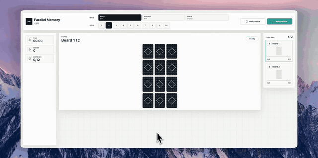

# Parallel Memory

複数の神経衰弱ボードを順番に切り替えながら解く、記憶力チャレンジWebアプリです。難易度と並列数を選び、タイム・手数・マッチ数を見ながら全ボードクリアを目指します。

## Play

https://parallelmemory.inazu.me/

## Demo

### Promo

### Gameplay

## Features

- Easy 3x4、Normal 4x4、Hard Trump の3段階難易度
- 1から10まで選べる並列ボード数
- ボードごとの進捗、タイム、手数、マッチ数の表示
- 同じ配置でのリトライ、新しいシャッフル、次の並列数への挑戦
- クリア結果のランク表示とX共有

Deployed to Cloudflare Workers.
